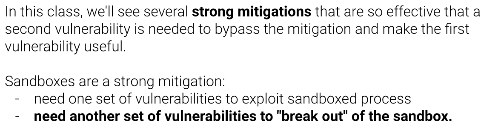

# Sandboxing

-----------**ASU CSE 365**: System Security

## Sandboxing: Introduction

untrusted code/data should live in a process with almost 0 permissions

- spawn "privileged" parent process
- spawn "sandboxed" child processes
- when a child needs to perform a privileged action, it asks the parent

## babyjail

level1: **Escape a basic chroot sandbox!**
