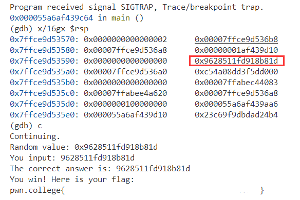
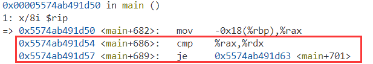

# Debugging Refresher

-----------**ASU CSE 365**: System Security

## GDB Walkthrough


## embryogdb

`GDB` is a very **powerful dynamic analysis tool**. 

level1: **using the command 'continue' or 'c' to continue program execution**

- We can use the command `start` to start a program with a breakpoint set on `main`
- We can use the command `starti` to start a program with a breakpoint set on `_start`
- We can use the command `run` to start a program with no breakpoint set
- We can use the command `attach <PID>` to attach some other already running program
- We can use the command `core <PATH>` to analyze the coredump of an already run program

```shell
Program received signal SIGTRAP, Trace/breakpoint trap.
0x0000562ea524dbe3 in main ()
(gdb) c
Continuing.
You win! Here is your flag:
pwn.college{a}
```

level2: **figure out the current random value of register r12 in hex**

You can see the values for all your registers with `info registers`. Alternatively, you can also just print a particular register's value with the `print` command, or `p` for short. 

For example, `p $rdi` will print the value of **$rdi** in decimal. You can also print it's value in hex with `p/x $rdi`

```shell
0x00005570c16a0bfd in main ()
(gdb) p/x $r12
$1 = 0xbd8828029758eae2
(gdb) c
Continuing.
Random value: 0xbd8828029758eae2
You input: bd8828029758eae2
The correct answer is: bd8828029758eae2
You win! Here is your flag:
pwn.college{a}
```

level3: **figure out the random value on the stack (the value read in from `/dev/urandom`).Think about what the arguments to the read system call are.**

Examine the contents of memory using the `x/<n><u><f> <address>` parameterized command. In this format 

- `<u>` is the **unit size** to display

  - Valid unit sizes are `b` (1 byte), `h` (2 bytes), `w` (4 bytes), and `g` (8 bytes).

  - ```shell
    (gdb) x/4bx $rsp
    0x7ffd419bf2c0: 0x02    0x00    0x00    0x00
    (gdb) x/4hx $rsp
    0x7ffd419bf2c0: 0x0002  0x0000  0x0000  0x0000
    (gdb) x/4wx $rsp
    0x7ffd419bf2c0: 0x00000002      0x00000000      0x419bf408      0x00007ffd
    (gdb) x/4gx $rsp
    0x7ffd419bf2c0: 0x0000000000000002      0x00007ffd419bf408
    0x7ffd419bf2d0: 0x00007ffd419bf3f8      0x00000001722e1d10
    ```

- `<f>` is the **format** to display it in

  - Valid formats are `d` (decimal), `x` (hexadecimal), `s` (string) and `i` (instruction).

  - ```shell
    (gdb) x/4gd $rsp
    0x7ffd419bf2c0: 2       140725704193032
    0x7ffd419bf2d0: 140725704193016 6210592016
    (gdb) x/4gx $rsp
    0x7ffd419bf2c0: 0x0000000000000002      0x00007ffd419bf408
    0x7ffd419bf2d0: 0x00007ffd419bf3f8      0x00000001722e1d10
    (gdb) x/4gs $rsp
    #warning: Unable to display strings with size 'g', using 'b' instead.
    (gdb) x/4bs $rsp
    0x7ffd419bf2c0: "\002"
    0x7ffd419bf2c2: ""
    0x7ffd419bf2c3: ""
    0x7ffd419bf2c4: ""
    (gdb) x/4gi $rsp
    0x7ffd419bf2c0:      add    (%rax),%al
    0x7ffd419bf2c2:      add    %al,(%rax)
    0x7ffd419bf2c4:      add    %al,(%rax)
    0x7ffd419bf2c6:      add    %al,(%rax)
    ```

- `<n>` is the **number of elements** to display. 

>  The address can be specified using a register name, symbol name, or absolute address

For example, `x/8i $rip` will print the next 8 instructions from the current instruction pointer. `x/16i main` will print the first 16 instructions of main. You can also use `disassemble main`, or `disas main` for short, to print all of the instructions of main. Alternatively, `x/16gx $rsp` will print the first 16 values on the stack.`x/gx $rbp-0x32` will print the local variable stored there on the stack.

You will probably want to view your instructions using the CORRECT assembly syntax. You can do that with the command `set disassembly-flavor intel`.



level4: **figure out a series of random values which will be placed on the stack**

-  `stepi <n>` command, or `si <n>` for short, in order to step forward one instruction
- `nexti <n>` command, or `ni <n>` for short, in order to step forward one instruction, while stepping over any function calls. The `<n>` parameter is optional, but allows you to perform multiple steps at once
-  `finish` command in order to finish the currently executing function
- `break *<address>` parameterized command in order to set a breakpoint at the specified-address.
- `continue` command, which will continue execution until the program hits a breakpoint.

- `display/<n><u><f>` parameterized command, which follows exactly the same format as the `x/<n><u><f>` parameterized command

For example, `display/8i $rip` will always show you the next 8 instructions. On the other hand, `display/4gx $rsp` will always show you the first 4 values on the stack.

Another option is to use the `layout regs` command. This will put gdb into its TUI mode and show you the contents of all of the registers, as well as nearby instructions.

If we want to remove the display rule, use the `undisplay <num>`

```shell
./xxx
(gdb)r
(gdb)display/4i $rip
(gdb)display/20gx $rsp

#finally we can find the change address is the rsp+0x30

(gdb)ni
#until the read
(gdb)ni
#until the scanf
#input the value of rsp+0x30
(gdb)ni #loop for a series of time
#finally get the flag
You win! Here is your flag:
pwn.college{abc}
```

level5: **use gdb scripting to collect the random values**

write commands to some file, for example `x.gdb`, and then launch gdb using the flag `-x <PATH_TO_SCRIPT>`. This file will **execute all of the gdb commands** after gdb launches. Alternatively, you can **execute individual commands** with `-ex '<COMMAND>'`

 You can **pass multiple commands** with multiple `-ex` arguments. Finally, you can have **some commands be always executed for any gdb session** by putting them in `~/.gdbinit`

You probably want to put `set disassembly-flavor intel` in there

**example1**

```shell
start
break *main+42
commands
  x/gx $rbp-0x32
  continue
end
continue

#whenever we hit the instruction at `main+42`, it will output a particlar local variable and then continue execution
```

**example2**

```shell
start
break *main+42
commands
  silent
  set $local_variable = *(unsigned long long*)($rbp-0x32)
  printf "Current value: %llx\n", $local_variable
  continue
end
continue

# the `silent` indicates that we want gdb to not report that we have hit a breakpoint, to make the output a bit cleaner.
#Then we use the `set` command to define a variable within our gdb session, whose value is our local variable.
#Finally, we output the current value using a formatted string.
```

Finally we should use the scripts below to help us to get the right random value.

```shell
start
run
break *main+709		#this is the read function
commands
        silent
        x/4gx $rbp-0x18		#this is the address of the changeable random value
        continue
end
continue
```

after 8 times trying:

```shell
Random value: 0x8e733529fc987483
You input: 8e733529fc987483
The correct answer is: 8e733529fc987483
0x7ffffe21f6e8: 0xd272a5aec670f4cf      0x8e733529fc987483
0x7ffffe21f6f8: 0x9a96e191d9931100      0x0000000000000000
The random value has been set!
....

You win! Here is your flag:
pwn.college{abc}
```

level6: **automatically solves each challenge by correctly modifying registers / memory**

Not only can gdb analyze the program's state, but it can also modify it. You can modify the state of your target program with the `set` command.

- `set $rdi = 0` to zero out $rdi
- `set *((uint64_t *) $rsp) = 0x1234` to set the first value on the stack to 0x1234
- `set *((uint16_t *) 0x31337000) = 0x1337` to set 2 bytes at 0x31337000 to 0x1337

Suppose your target is some **networked application** which reads from some socket on **fd 42**. Maybe it would be easier for the purposes of your analysis if the target instead read from stdin. You could achieve something like that with the following gdb script:

```shell
start
catch syscall read
commands
  silent
  if ($rdi == 42)
    set $rdi = 0
  end
  continue
end
continue
```

This example gdb script demonstrates how you can automatically break on system calls, and how you can use conditions within your commands to conditionally perform gdb commands.

- In this level we should look carefully at the logic of this program. First we can use `display/8i $rip` to find out how the program works:



- If the value in rax is equal to value in rdx, it will jump to the main, not the exit. After several times it will go to the **win** function to print out the flag, so what we should do is break at the cmp and make them **identical**.

scripts like:

```shell
#y.gdb
start
run
break *main+686
commands
        silent
        set $rdx = $rax
        continue
end
continue
```

use:

```shell
/challenge/embryogdb_levelx -x y.gdb
#input any words and for several times, get the flag
```

level7: **run the command `call (void)win()`**

Under normal circumstances, gdb running as your regular user cannot attach to a privileged process. This is why gdb isn't a massive security issue which would allow you to just immediately solve all the levels. 

**Running within this elevated instance of gdb gives you elevated control over the entire system.**

```shell
(gdb) call (void)win()
You win! Here is your flag:
pwn.college{a}
```

level8: **call (void)win() broke**

Note that this will not get you the flag (it seems that we broke the win function!), so you'll need to work a bit
harder to get this flag!

**First TRY**

```shell
(gdb) call (void)win()

Program received signal SIGSEGV, Segmentation fault.
0x000055ea1b53d969 in win ()
The program being debugged was signaled while in a function called from GDB.
GDB remains in the frame where the signal was received.
To change this behavior use "set unwindonsignal on".
Evaluation of the expression containing the function
(win) will be abandoned.
When the function is done executing, GDB will silently stop.
```

In this level we should find out why the program segment fault.

```shell
(gdb) set disassembly-flavor intel
(gdb) r
(gdb) x/30i win
   0x55ea1b53d951 <win>:        endbr64 
   0x55ea1b53d955 <win+4>:      push   rbp
   0x55ea1b53d956 <win+5>:      mov    rbp,rsp
   0x55ea1b53d959 <win+8>:      sub    rsp,0x10
   0x55ea1b53d95d <win+12>:     mov    QWORD PTR [rbp-0x8],0x0
   0x55ea1b53d965 <win+20>:     mov    rax,QWORD PTR [rbp-0x8]
   0x55ea1b53d969 <win+24>:     mov    eax,DWORD PTR [rax]
   0x55ea1b53d96b <win+26>:     lea    edx,[rax+0x1]
   0x55ea1b53d96e <win+29>:     mov    rax,QWORD PTR [rbp-0x8]
   0x55ea1b53d972 <win+33>:     mov    DWORD PTR [rax],edx
   0x55ea1b53d974 <win+35>:     lea    rdi,[rip+0x73e]        # 0x55ea1b53e0b9
   0x55ea1b53d97b <win+42>:     call   0x55ea1b53d180 <puts@plt>
```

The error is at the `<win+12>`.  **mov [rbp-0x8], 0x0** and then `<win+20>` **mov rax, [rbp-0x8]**. In `<win+24>` **mov eax, [rax]** the [rax] ([0x0]) will make error. So we should jump out to the **lea instruction** and skip the segment faults.

```shell
(gdb) set $rip = 0x55ea1b53d96b
(gdb) c
#get the flag
```

**NOTE: This level refers to this [video](https://www.twitch.tv/videos/1753535070) and we can find it at [there](https://discord.com/channels/750635557666816031/888220401933631489/1081331559635886100)**

